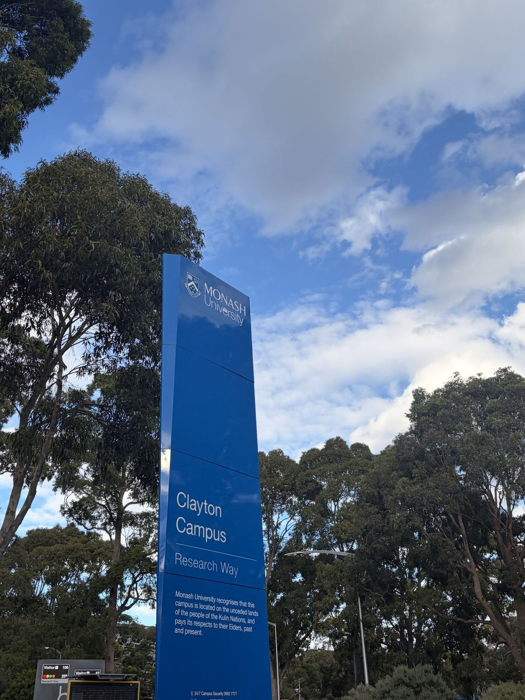
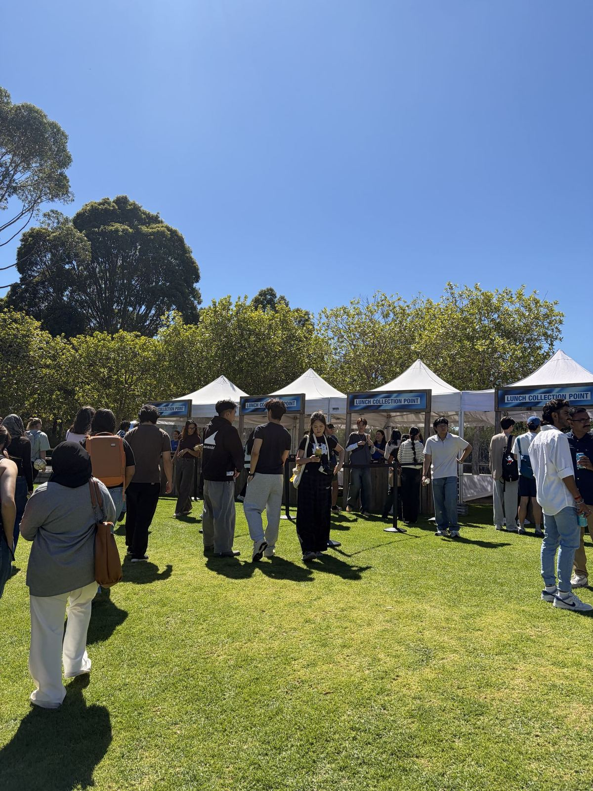
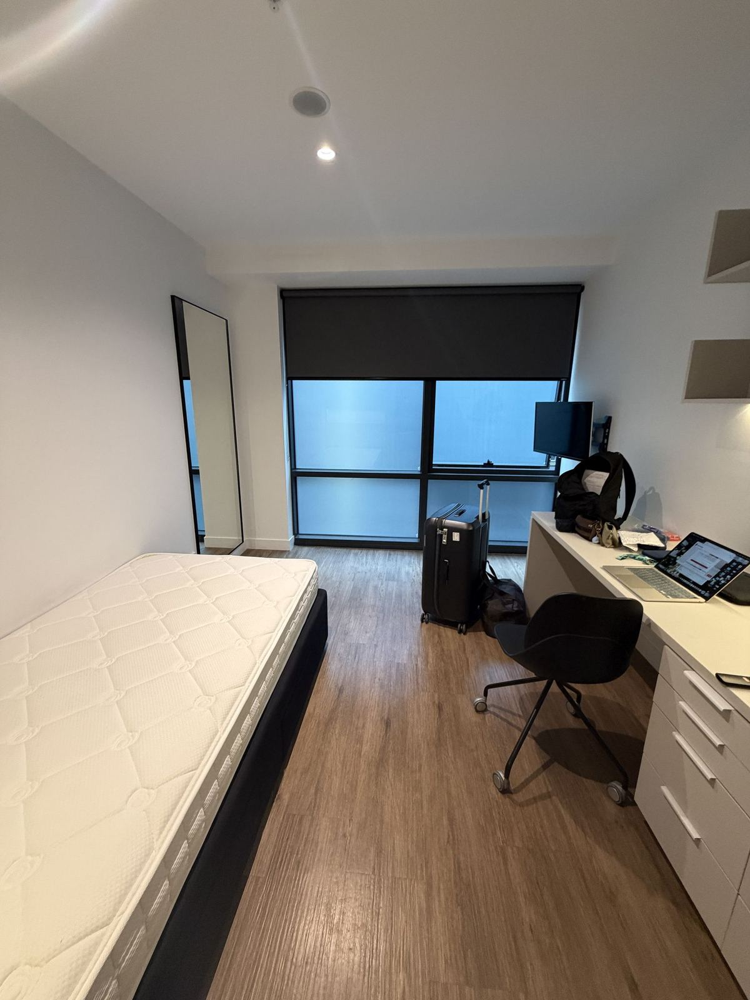
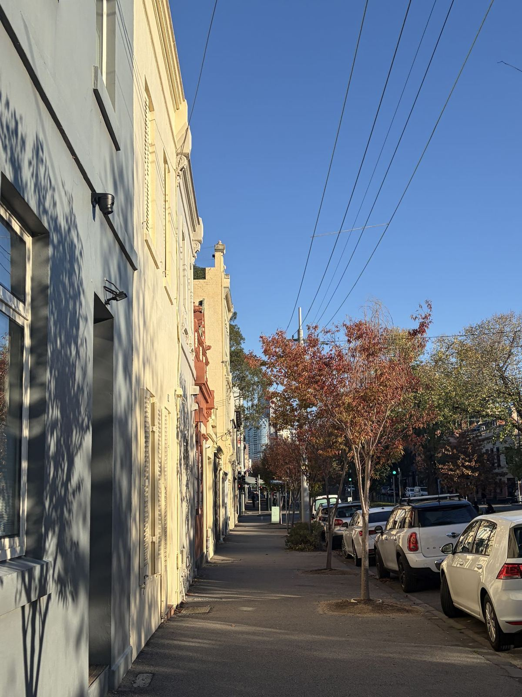

114-2 學期，我到澳洲墨爾本的 Monash University 交換一學期。這系列整理了交換前後的準備、課業與實習，以及在墨爾本生活的心得。

## 學校介紹

Monash University 位於墨爾本，在墨爾本一共有四個主要校區，分別是 Clayton、Caulfield、Peninsula、Parkville，另外它也有許多海外校區，因此去交換也會認識不少來自其他 Monash 海外校區的學生。以澳洲來說，大多數課程應該都是在 Clayton 與 Caulfield 進行，這兩個校區都位於 Cranbourne、Pakenham、Sunbury 這條火車路線上（淺藍色線）。其中 Caulfield 距離 CBD 約 20 到 30 分鐘車程，旁邊也有 Route 3 的 Tram 可以搭乘；Clayton 就離市區較遠，單趟車程約 50 分鐘，可以搭火車到 Huntingdale 轉乘 601／630／900 這三台公車到校區。雖然車程感覺很久，但整體而言我覺得與市區的交通算相當方便。

學校周邊就是典型的澳洲城市近郊，車站附近會有比較熱鬧的商店街，有比較多餐廳、咖啡店與超市可以採買。值得一提的是學校附近有個 Mcity，算是一座大型商場，裡面有超市、餐廳與理髮廳，假日時學校也有提供採買接駁車可供往返。從 Mcity 再往下走則有一間 Ikea，如果需要買傢俱可以在那裡購買。治安部分，澳洲整體治安都算蠻好的，儘管偶有耳聞搶劫車輛或毒品問題，我個人覺得澳洲治安與台灣狀況差不多，也經常看到咖啡廳或 Food Court 有人用手機或錢包佔位，但當然出門在外還是建議注意個人財物。

Monash 乃至於整個 Melbourne 都相當國際化，校園與城市裡有來自各種國家的學生，也有許多人是移民後代，因此絕對不能根據外表判斷對方是不是澳洲人。不過根據我個人與聽聞其他交換生的經驗，要認識其他交換學生並沒有想像中容易，除了開學前的 O-week 以外，並沒有太多活動能真的認識其他學生；同時因為 Monash 有許多交換生是從馬來西亞校區交換而來，多數人已經有自己的圈子。如果想要認識其他人，建議還是需要參加社團，或者在課堂上積極跟其他同學互動。

## 行前準備

### 提名與選課

在獲得台大校內甄選的提名資格以後，學校會正式向 Monash 進行提名，提名後就會收到 Monash 提供的相關申請指引（也可以參考網頁），這個時候也會要求你進行選課。可以透過 Monash Handbook 尋找有興趣的課程，Monash 全職學生的選課下限是 18 credits（大概是三個 units），上限是 24 credits（大概是四個 units）。雖然在提交申請時學校就會要求你選好課程，但後續仍然有機會加選或退選。另外要注意許多課程有先修要求，會需要在台灣的修課紀錄證明等。

學校也有提供保險（OSHC）可以直接購買，因為必須要有這個保險才能申請簽證，我當時是直接透過學校投保。這些申請都完成提交以後，就會拿到學校的 Offer letter，接著也會拿到 Certificate of Enrollment（CoE），後者需要用於簽證申請。整個流程所花費的時間非常不固定，我個人的經驗是在提名並完成申請資料填寫的一個星期後就拿到 CoE，但也有聽聞前後等了一個多月的案例，只能說在獲得提名後就盡快處理，以免壓縮到後續申請簽證的時間。

### 簽證

拿到 CoE 之後，就可以著手申請澳洲簽證。申請時需要先到 immiAccount 申請一個帳戶，之後就能開始填寫簽證申請。學生簽證的事項相當多，除了基本資料以外，也包含家庭成員、財務證明、出國紀錄等等，比較麻煩的是 Genuine Student Statement，主要功能是讓移民局確認你是真的來唸書的學生。看過去其他人的申請經驗，主要就是照實填寫即可；並且由於交換學生並沒有要在澳洲拿到學位，在選擇 Education Sector 時務必選擇 **Non-award Sector**，會讓審查流程簡化很多。下簽時間也因人而異，我聽到的大概都是一個星期內會拿到簽證，不過也有等了一個多月的案例，同樣建議越早申請越好。

### 住宿

**Monash 並沒有提供交換學生保證住宿！！** 由於校內住宿申請狀況非常激烈，同時並不需要拿到入學許可才能申請宿舍，建議知道要去交換以後，就在預計交換學期的住宿申請開放當天去申請，比較有機會申請到理想的房型。校內住宿有 Urban Community 與 Residential Village 可以選擇：Urban Community 比較新，多是 Studio 的選項，也就是房間內包含床、浴室與廚房；Residential Village 則是共用衛浴及廚房，價格上當然是 Urban Community 會稍貴一些。

不過我因為有一個在 City 的實習，當時並沒有選擇校內住宿，而是住在靠近市區的私人學生公寓，價格就比較高。按照我當時找住宿的經驗（2025 年底），CBD 含水電網路的 Studio 每週大概在 500 澳幣附近，Shared Apartment 約 400–450 澳幣，也會有一些 Shared Room 的選項，價格可以到 200–300 澳幣。

住在市區另一個需要考量的點是交通。我個人覺得墨爾本的火車與路面電車還算方便，雖然火車在週末與夜間可能會停駛，誤點也偶爾會發生（體感比台鐵頻繁許多），但市區到學校的交通時間還算可接受，火車上也都有位子，因此我當時認為交通並不是太大的問題。住宿選擇除了私人學生公寓以外，也有聽到透過臉書社團或落地澳洲之後再找的案例，就看個人需求決定。

### 銀行與電信

澳洲幾乎任何地方都接受電子支付，就連路邊的咖啡廳或小餐廳都可以用信用卡，因此在澳洲期間多數時候是直接用 Apple Pay 刷當地銀行的 Debit Card，幾乎沒有用過現金。銀行開戶我選擇 Commonwealth Bank，似乎是澳洲交換學生最常見的選項，開戶時除了日常帳戶以外，也可以開設 Saving Account 順便賺相當高的利息。

手機電信方面，我當時是先在 Finder 找便宜或有特價的 Pre-paid plan，到澳洲之後可以去超市買電信流量加值。澳洲的超市經常會有半價優惠，可以算好用量，趁特價時一次購入能省下不少錢。另外如果都在學校，可以直接使用 eduroam，不論用台大帳號或 Monash 帳號都可以連上網。

### 收拾行李

特別想提醒：抽取式衛生紙與隱形眼鏡在澳洲不太好買，不然就是特別貴。除此之外的東西在澳洲都買得到，價格也都和台灣差異不大（量販店推薦 Kmart 或 BigW），有些宿舍也會有前人留下來的東西可以使用。另外，如果抵達墨爾本的時間是冬天，要特別注意墨爾本的冬天非常冷，雖然溫度看起來還好，但強風和不時飄雨的天氣會讓體感溫度更低，建議多穿幾層，防水外套也是墨爾本人常見的衣服。
