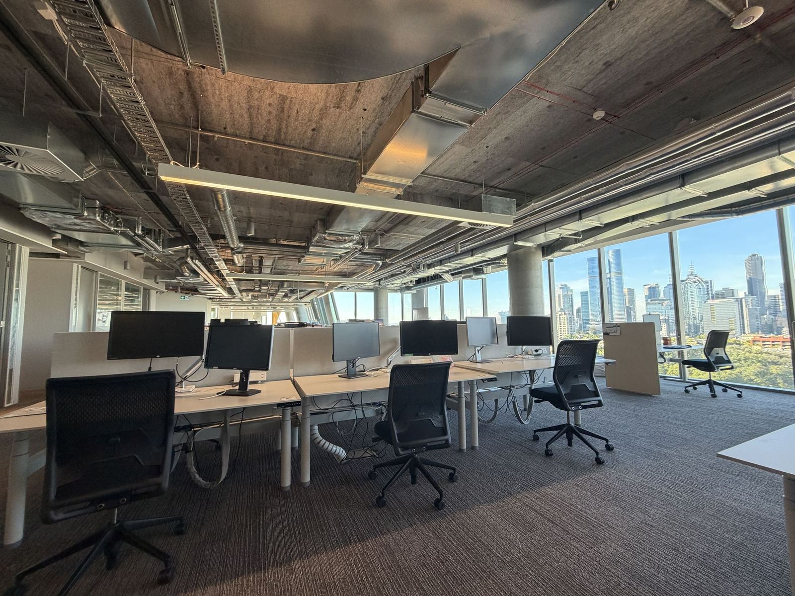

## 上課方式與評分

這裡上課的方式多會分成 Lecture 和 Tutorial 或 Workshop。Lecture 就是老師講課，疫情後都已經變成線上進行，需要在上課前把線上影片看完，並且閱讀 Required reading，之後再去學校上 Tutorial 或 Workshop。這部分看老師要求，但大部分也不強制出席，其他相關要求都可以在選課時於 Handbook 裡找到。

給分的部分，澳洲學校大多採用七分制的 GPA，及格是 50 分以上，多數人的分數會落在 60–80 分之間，基本上能拿到 80 分以上就已經是非常優秀的等級：不只要完全做到作業要求，同時也需要有明確超出老師預期的表現。我在 Monash 一學期一共修了 3 門課，共 18 credits。

## ATS1254 – Culture, Power and Difference

這是一堂主要關於澳洲原住民的課程，從人類學的角度討論澳洲原住民文化。最開始選這堂課，是因為申請時經常看到澳洲各處都會有關於原住民的 Acknowledgement，因此對背後的歷史感到好奇。不過這堂課的切角比我想像中深入許多，課程並沒有花太多篇幅介紹殖民歷史與原住民文化本身，而是從本體論出發，反思這個社會之於原住民、以及原住民之於這個社會的關係，並以語言、知識的形成、土地權等主題為核心，討論不同族群看待世界的差異。

我想這堂課最有趣的地方在於，即使作為外籍學生，我們的觀點也會被放進課堂中討論。因為外籍學生身處澳洲時作為他者的事實，更容易理解文化差異帶來的思維邏輯不同。其中一項作業是 Reflective writing，目的是讓大家能從課堂主題中反思自己與這個知識的關係，我就從交換學生來到澳洲作為他者的角度來思考。

## ATS2267 / ATS3327 – True Happiness

這堂課主要是正向心理學的實踐課程，核心問題是想回答「什麼是真正的快樂」（What is true happiness?），從與快樂有關的三個挑戰、三個解決方法以及三大生命問題出發，結合心理學實證研究成果以及一些佛教和哲學觀點。比較印象深刻的是，幾乎每個星期的 workshop 開始與結束前，講師都會帶大家進行 meditation 練習。因為我過去沒有參與過正念練習或類似的課程，所以是蠻特別的經驗。

## ATS2292 – The Ethics of Artificial Intelligence

這堂課的內容就如它的名稱，主要討論人工智慧應用在各個領域的倫理議題。老師是一位在科技倫理和生物倫理非常厲害的教授，Tutorial 每個星期都會針對某個主題讓同學進行討論。我覺得課程中學到最多的並不是倫理知識本身，而是討論倫理議題時所使用的方法，比如透過各種情境假想來探索自己對於是否符合倫理的底線位置、如何闡述自己的論點讓對方理解等等，作業中也有很多反駁或支持某些論點的練習。

## Complex Human Data Hub：Research Intern

這個實習機會是我自己找的。Complex Human Data Hub 是墨爾本大學心理學院底下的研究中心，因為我有規劃想在國外的學術單位發展，希望能在交換期間看看這裡的研究環境，於是就四處尋找可能的實習機會，剛好媒合上研究中心的老師，便在他的指導下進行了一段時間的跨語言對齊相關研究。

從硬體環境來說，Complex Human Data Hub 位在墨爾本大學的 Melbourne Connect 大樓內，因為大樓是新的，環境真的非常好，有免費的茶水和牛奶可以使用，辦公室也很舒服。開放的工作空間讓大家有很多機會交流，加上每星期固定的 Research Talk 結束後有免費的午餐聚會可以參加，在這裡似乎更容易認識當地人。

如果談到研究風氣，以心理學而言，這裡的研究典範主要承襲歐洲的風格，很多研究員也出身自歐洲的學術訓練，與台灣偏美國的背景差異很大。此外研究思維也相當重視巨量資料處理的技巧，許多研究方法都會利用計算方法可擴展性高的特色，嘗試進行很大規模的研究，或專注在開發套件讓更多人可以使用，這些都是在台灣心理學環境裡比較看不到的發展方向。
