交換除了在學校上課以外，有更大部分的時間是與自己和這座城市相處，這是一個很有趣的過程。墨爾本是一座很值得探索的城市，某個街口巷尾總能發現一些意想不到的驚喜，可能是某種沒吃過的異國料理、某杯特調咖啡、某棵很美的樹。

## 天氣

儘管墨爾本算是個四季分明的城市，多數時候的天氣都相當宜人。我最初抵達的 2 月初，溫度與台灣初夏相近，高溫大概可以到 30 度，傍晚與清晨約莫 20 出頭，並不會熱到很不舒服，但聽說 1 月左右白天溫度可能突破 40 度，儘管天數不多但非常熱。3 月到 4 月我覺得是最舒服的季節，溫度不太會超過 30 度，整體濕度也不高，日落時間仍然很晚，可以享受非常舒服的陽光。5 月以後溫度會明顯轉涼，秋天的溫度體感上應該和台灣的冬天差不多，多雲或下雨的天氣也會明顯增加。最後，墨爾本的冬天可以非常寒冷，儘管溫度看起來還好，但因為經常伴隨飄雨和強風，體感溫度會更低，如果是七月抵達可能要多準備一些衣物。

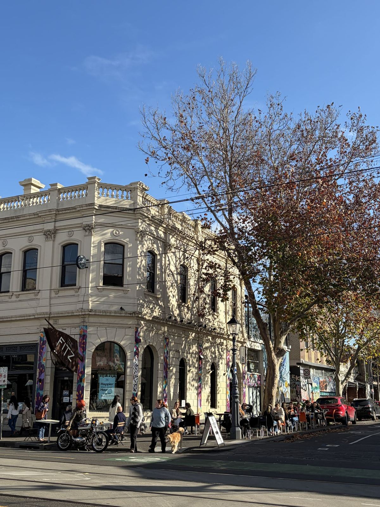

此外，儘管多數時候墨爾本都是陽光明媚，但低壓過境時天氣會忽然變得非常差，除了風非常大以外，也偶爾會伴隨異常的大雨，而且不一定只在冬天發生。像我二月剛抵達時，就出現過整天溫度不超過 20 度，也經常上午出太陽、下午就突然變冷下雨。

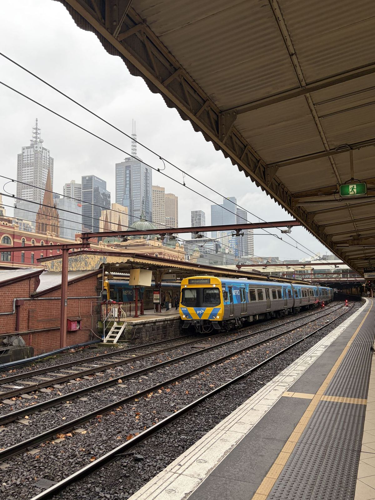

## 食物

墨爾本是個非常國際化的城市，幾乎世界各地的食物都能在這裡找到。學校內的食物大概是 10–15 澳幣（約台幣 200–300 元），離開學校到市區大概要 20–30 澳幣（約台幣 400–600 元），其實並不便宜，因此多數時候還是自己煮飯居多。白米如果想吃到比較接近台灣的口味，可以在超市找壽司米來煮；以方便程度來說，義大利麵和烏龍麵都是蠻容易的選擇。

不過我仍然蠻推薦有機會的話多多探索不同的食物。我在這裡嘗試過熱壓吐司、希臘烤肉捲餅（Souvlaki）、土耳其烤肉（Kebab）、越南河粉、Taco 等等，其實都蠻好吃的。至於中國菜的部分……我覺得大部分沒有好吃到能滿足台灣胃啦，但麻辣燙還不錯，特別是冬天很冷的時候。


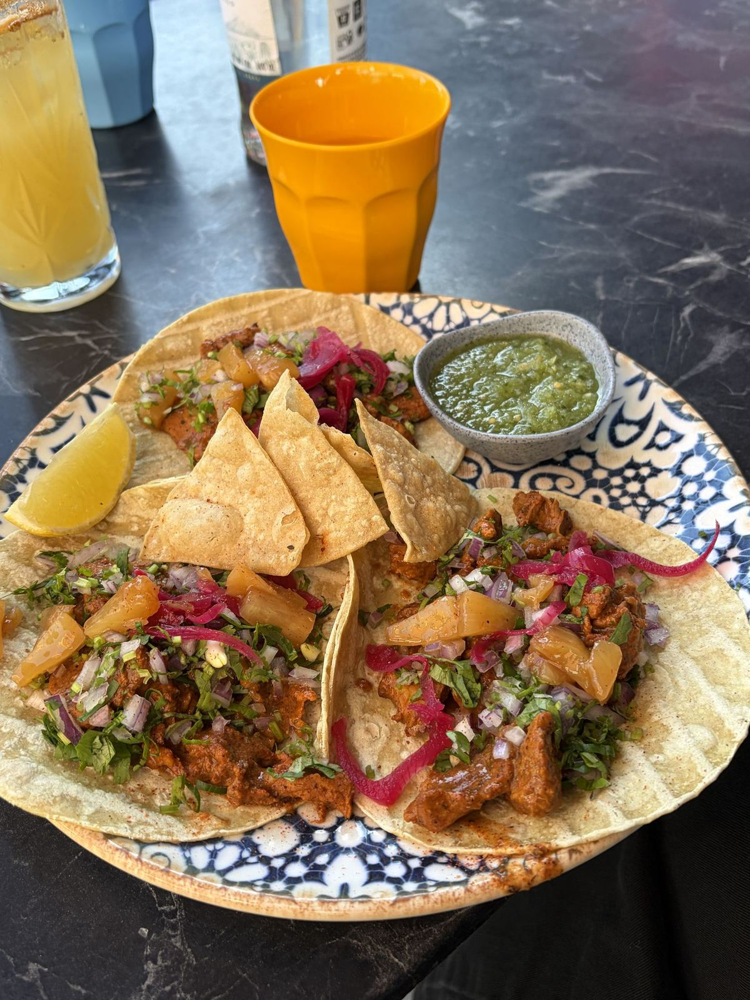
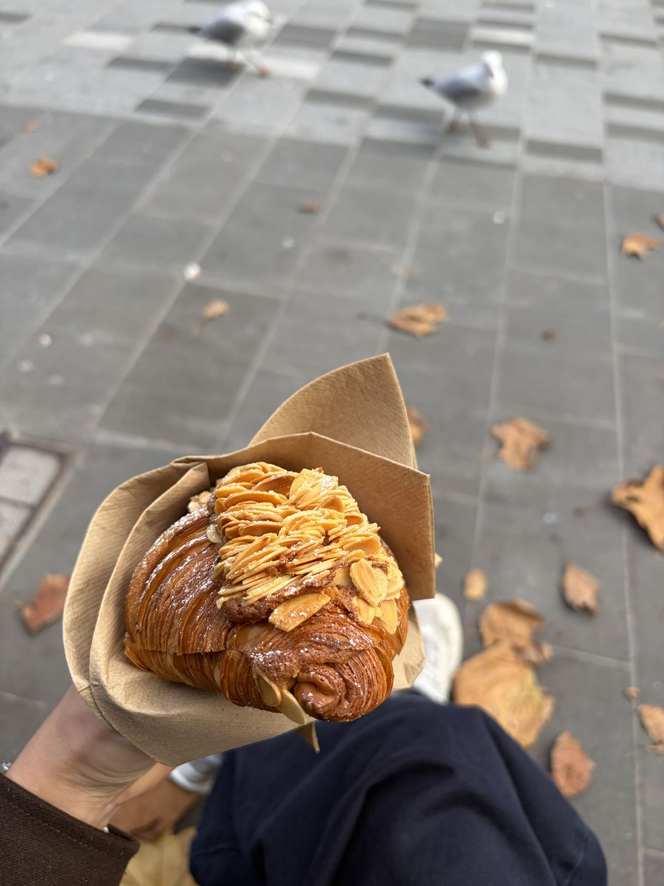
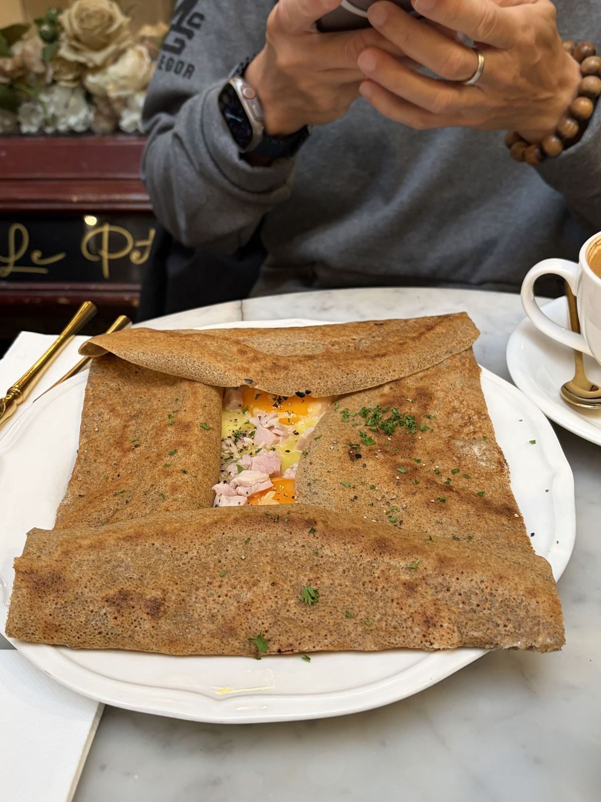
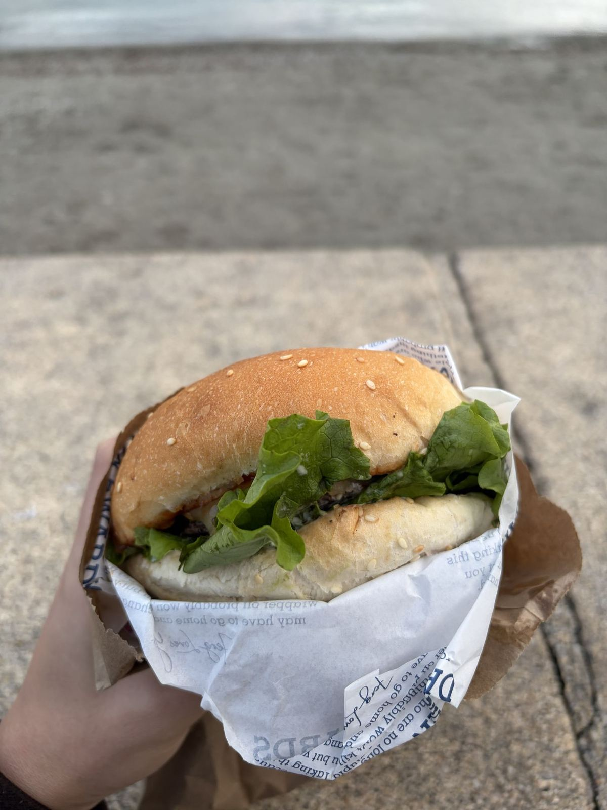
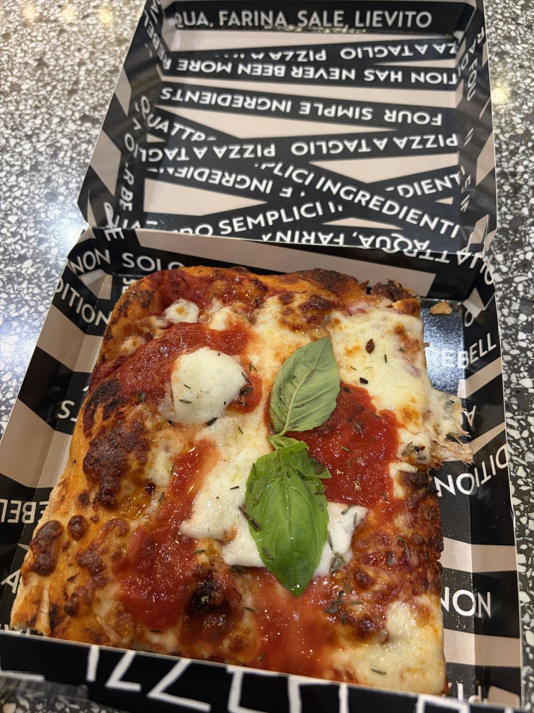
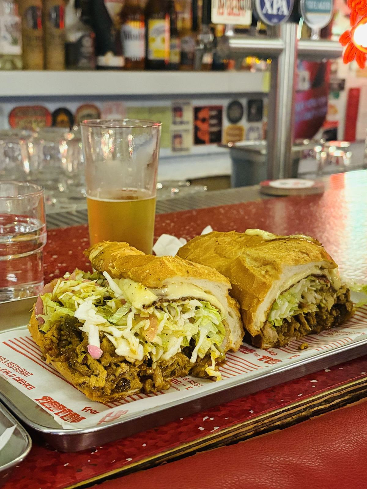


## 咖啡

咖啡應該算是墨爾本的靈魂，曾經聽當地人說過，咖啡是這座城市最令他們驕傲的一部分。來澳洲以前我是不太喝咖啡的，但這半年養成了偶爾來一杯的習慣，我想咖啡之於墨爾本，應該就類似手搖飲之於台灣的存在吧。

以品項來說，很推薦來澳洲嘗試看看 Flat white，它類似拿鐵，但通常小杯很多，主要是濃縮咖啡加上少量的牛奶與奶泡。另外 Long black 與 Magic 也是大洋洲蠻特別的品項。至於咖啡廳，不同於台灣常見的連鎖品牌，墨爾本的咖啡文化在於多數咖啡廳都不是連鎖的，或有完整店面，或藏身巷弄，或位處車站月台，且多數都有自己獨特的風格。最有名也最推薦的應該是 Good Measure，位在墨爾本大學附近，我經常和朋友約在這裡聊天或工作，它最有名的品項是 Mont blanc。通常早上與週末人潮最多，不過因為它開到很晚，傍晚再去人比較少，也是不錯的選擇。此外 Fitzroy 與 Richmond 也有不少咖啡廳或麵包店，有機會非常推薦自己去探索看看。


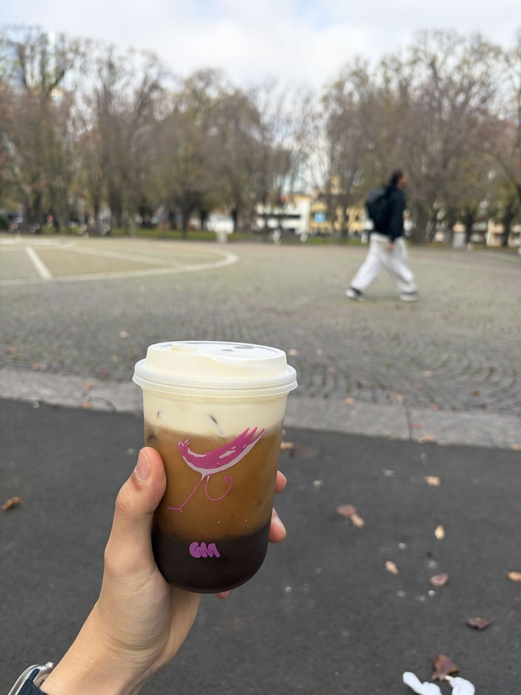
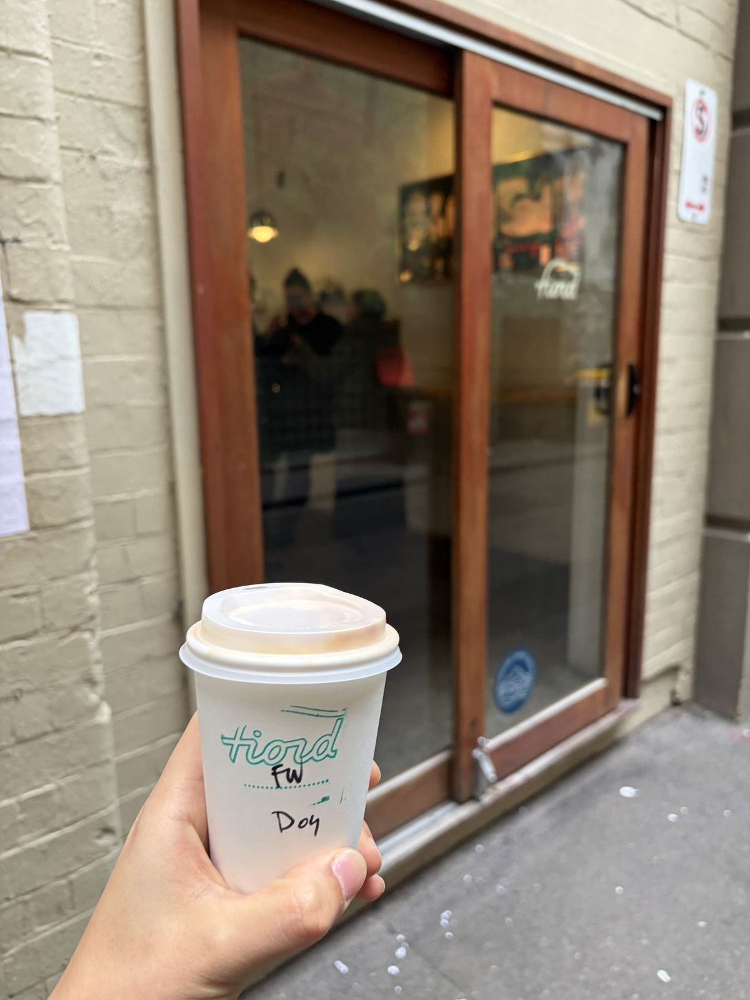
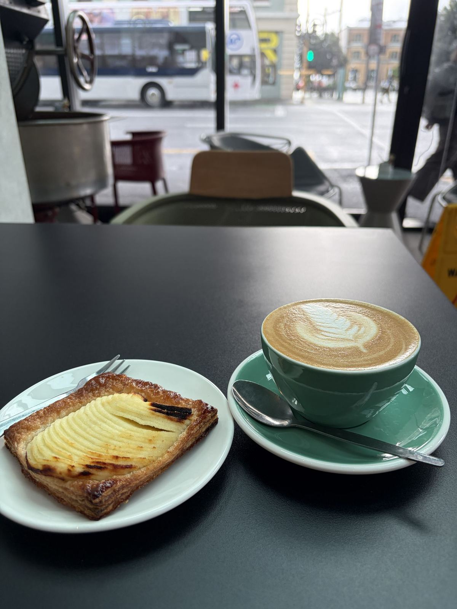
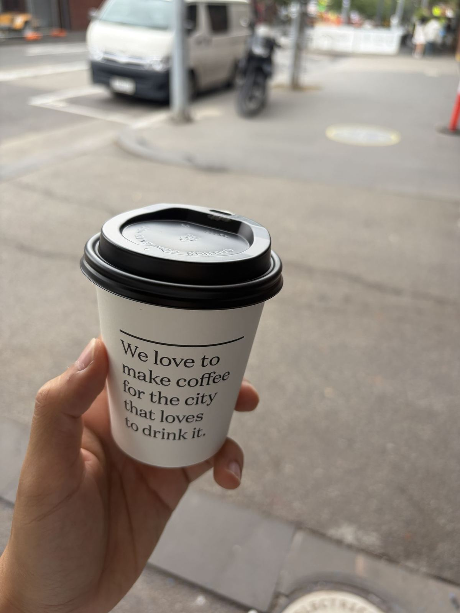


## 適應與成長

剛開始交換時，我就曾經與一起交換的朋友聊到，交換所帶來的成長究竟會是什麼。當時我們有一致的共識：交換是一個更加認識自己的機會。

其實剛抵達的幾個星期並不好過。你會身處一個幾乎完全陌生的地方，從零開始建立一切習慣，再加上交換時間之不長不短，逼得你去抓住所處城市的吉光片羽，即使只是電車上一幅台灣觀光廣告亦然。你被迫面對生活的一切細節，你被迫慢下來，因為你得花力氣適應，你得花力氣理解另一個世界，你得花更多力氣照顧好自己。這裡的照顧自己不是那種空泛的祝福，是你得在超市的十幾種米中找到熟悉的味道，是用不熟悉的語言處理開戶、租約等行政文件，是去走過離家遙遠的大街小巷，讓生活感變得沉重而結實，畢竟有太多習慣是你平時難以注意的。最終，你非得思考自己喜歡什麼、自己在乎什麼，這是最容易照顧好自己的方法。

這是一個你成為他者的機會。你是這個國家的他者，是這座城市的他者，甚至在全校 orientation week 之時似乎也是他者；同時某方面而言，你是成績的他者，你是許多不成文規範的他者。這是墨爾本很溫柔的地方，它允許你不完整，允許你慢慢認識，允許你作為他者，而有機會誠實面對自己——那個搬著棉被枕頭，可能手上還提著葡萄與牛奶，在電車上忘記 tap on Myki 而有點手足無措的自己。隨著時間推進，這樣的孤立感會漸漸被熟悉感取代：你開始明白搭電車何時要刷卡，你開始知道火車停駛該怎麼辦，你開始找到特別喜歡的那幾家咖啡店，你開始擁有屬於自己的墨爾本。這不再是遙遠的大洋彼岸的某個國外城市，而是一步步生活痕跡所沉澱之處。

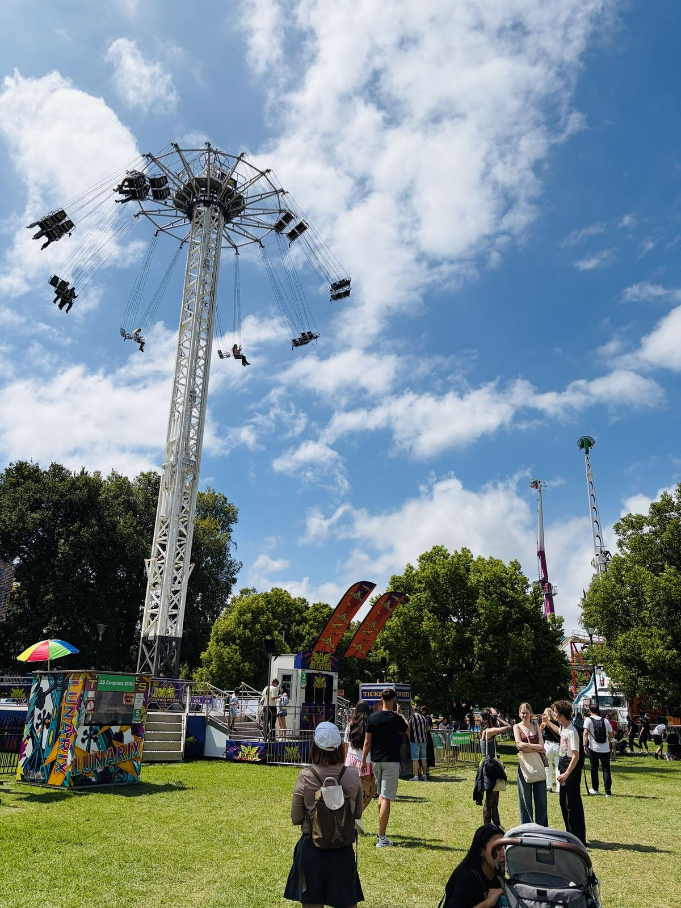

同時，你並不是一個人經歷這一切。你會遇見一些夥伴，他們或許與你同樣是他者，或許早已在此生根，但你們會在某些時刻相遇：可能只是一面之緣，可能是某次演講很尷尬的 small talk，可能是某次活動發現你們居然同名，或者某次一起野餐、一起煮剝皮辣椒雞湯。你們將一起逐漸把城市變得熟悉，一起寫報告，一起看日落，一起在學期結束後最後一次出遊，一起學習如何道別。

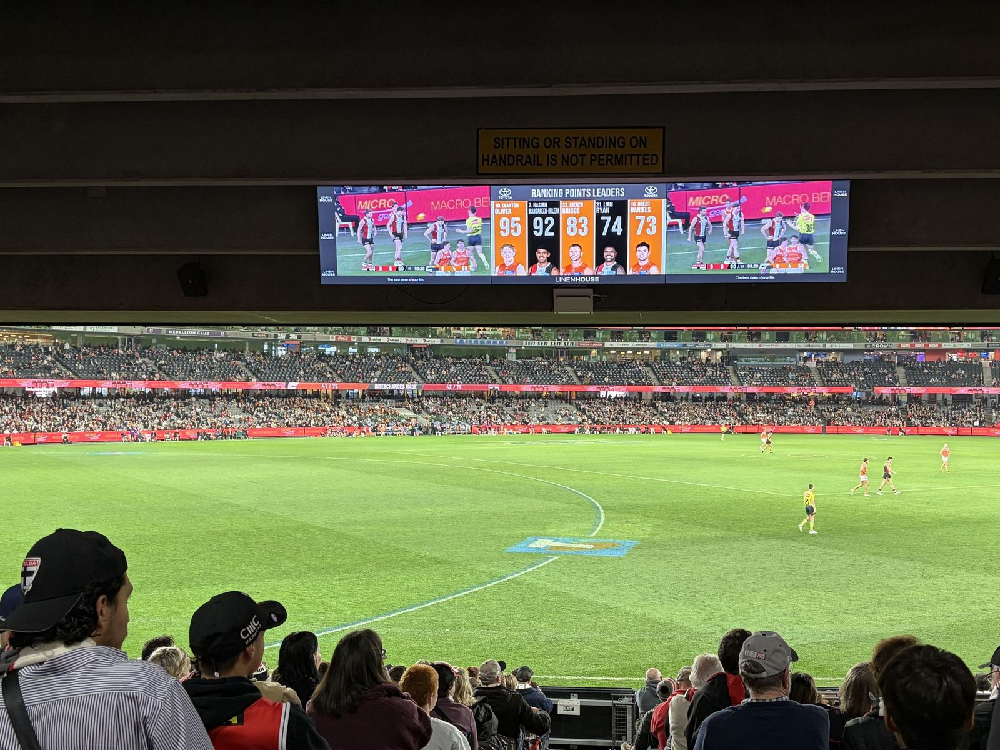

如果你也正準備踏上這段旅程，我想說的是，不必害怕這一切的手足無措。儘管交換生活的一切我們都未曾經歷，我們固然會在初次體驗時顯得有些笨拙，但正是因為這些笨拙的日子，才顯得每個習以為常都格外真實。


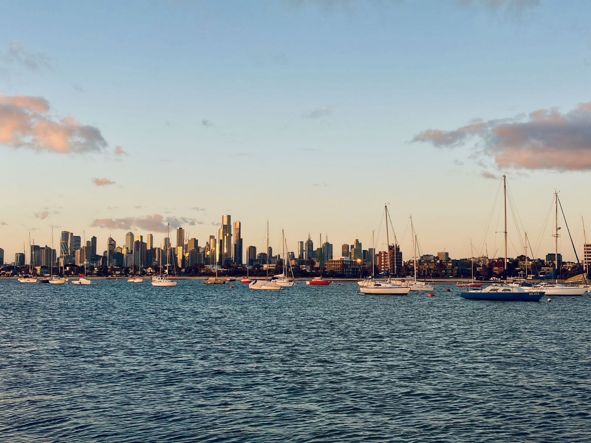
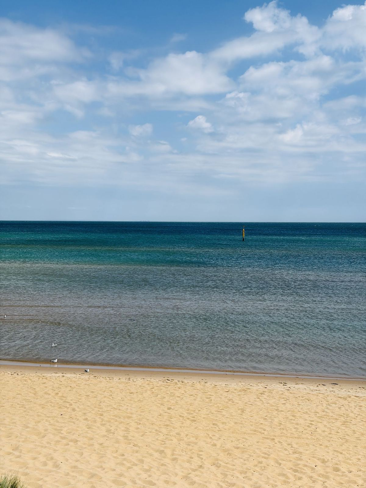
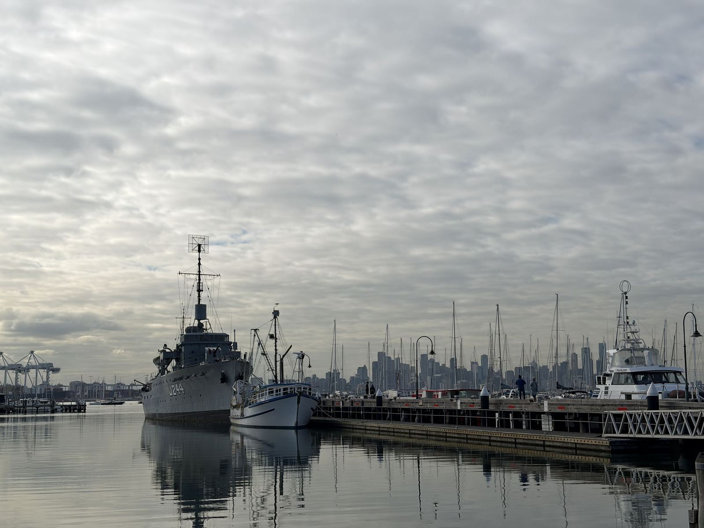

